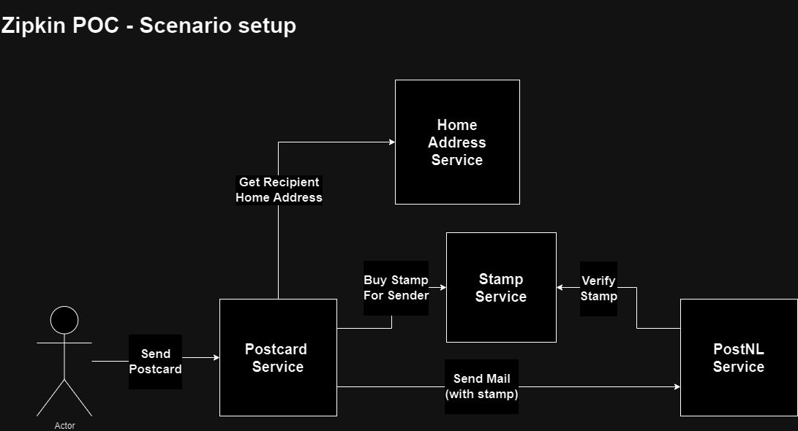

# zipkin-poc

Basic post office microservice application to demo Zipkin.



### About zipkin
Zipkin is a distributed tracing system.   
It helps gather timing data needed to troubleshoot latency problems in service architectures.     
Features include both the collection and lookup of this data.

Zipkin helps to create an overview of traffic between distributed services.   

More info on the [Zipkin](https://zipkin.io/) website

### Local development
Build all modules:
```shell
mvn clean package -DskipTests
```
Start local environment
```shell
docker compose up --build
```

Send a request using Postman: 
```
POST http://localhost:9093/send-postcard
{
    "sender": "person2",
    "recipient": "person1",
    "cardText": "Hello world! :)"
}
```

Open the Zipkin UI in your browser: 
```shell
http://localhost:9411
```